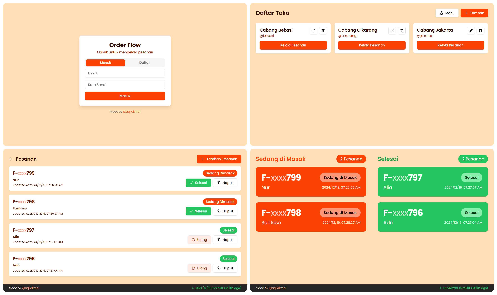

# Order Flow

A modern order tracking application designed specifically for small and medium-sized food and beverage businesses in Indonesia. Perfect for warung, cafe, and restaurant owners who need a simple yet beautiful solution to manage their orders and display order status to delivery drivers and customers.

Dibuat khusus untuk pemilik bisnis F&B di Indonesia yang membutuhkan solusi sederhana namun elegan untuk mengelola pesanan mereka.

## 📸 Screenshots

<div align="center">
  
  <p><em>Screenshots of the application in action</em></p>
</div>

## ✨ Features

- **Store Management**

  - Multi-store support for business owners
  - Unique store IDs for easy access
  - Store details customization
  - Secure store ownership
- **Admin Dashboard**

  - Real-time order management
  - Order status updates
  - Order deletion
  - Customer name tracking
- **Public Order Display**

  - Real-time order status updates
  - Clean and intuitive interface
  - Mobile-responsive design
- **Modern Tech Stack**

  - Type-safe development with TypeScript
  - Real-time updates with TanStack Query
  - Form validation with Zod
  - Beautiful UI with Tailwind CSS and shadcn/ui
  - Secure authentication with Supabase

## 🚀 Technologies Used

### Frontend

- React + Vite
- TypeScript
- Tailwind CSS
- shadcn/ui
- TanStack Query
- Zod
- React Router
- Heroicons
- React Hook Form
- Jotai (State Management)

### Backend

- NodeJS
- Hono (Framework)
- Drizzle (ORM)
- Supabase (Auth and Database)

### DevOps

- Docker
- Coolify (Deployment)

## 🛠️ Getting Started

### Prerequisites

- Node.js 20 or higher
- npm
- Docker (for containerized deployment)

### Local Development

1. Clone the repository:

   ```bash
   git clone https://github.com/aqilakmal/order-flow.git
   cd order-flow
   ```
2. Install dependencies:

   ```bash
   # Frontend
   cd frontend
   npm install

   # Backend
   cd ../backend
   npm install
   ```
3. Set up environment variables:

   ```bash
   # Backend
   cp backend/.env.example backend/.env
   # Fill in the required environment variables

   # Frontend
   cp frontend/.env.example frontend/.env
   # Fill in the required environment variables
   ```
4. Start the development servers:

   ```bash
   # Backend
   cd backend
   npm run dev

   # Frontend (in a new terminal)
   cd frontend
   npm run dev
   ```

### Docker Deployment

1. Build and run with Docker Compose:
   ```bash
   ./docker.run.sh
   ```

## 📝 Available Scripts

### Frontend

- `npm run dev` - Start development server
- `npm run build` - Build for production
- `npm run preview` - Preview production build
- `npm run lint` - Run ESLint
- `npm run format` - Format code with Prettier
- `npm run format:check` - Check code formatting

### Backend

- `npm run dev` - Start development server
- `npm run build` - Build for production
- `npm run start` - Start production server
- `npm run format` - Format code with Prettier
- `npm run format:check` - Check code formatting

## 🔒 Environment Variables

### Backend

- `NODE_ENV` - Environment (development/production)
- `DATABASE_URL` - PostgreSQL database URL
- `PORT` - Server port
- `SUPABASE_URL` - Supabase project URL
- `SUPABASE_ANON_KEY` - Supabase anonymous key
- `SUPABASE_SERVICE_ROLE_KEY` - Supabase service role key
- `FRONTEND_URL` - Frontend application URL
- `INVITE_CODE_START` - Starting code for invite generation

### Frontend

- `VITE_API_URL` - Backend API URL

## 📚 API Documentation

The application exposes the following API endpoints:

### Stores

- `GET /stores` - Fetch all stores owned by the authenticated user
- `POST /stores` - Create a new store
- `PATCH /stores/:id` - Update store details
- `DELETE /stores/:id` - Delete a store

### Orders

- `GET /orders` - Fetch all orders
- `POST /orders` - Create a new order
- `PATCH /orders/:id` - Update order status
- `DELETE /orders/:id` - Delete an order

## 📄 License

This project is licensed under the MIT License - see the [LICENSE](LICENSE) file for details.

## 👨‍💻 Author

Made with ❤️ by [@aqilakmal](https://github.com/aqilakmal)
